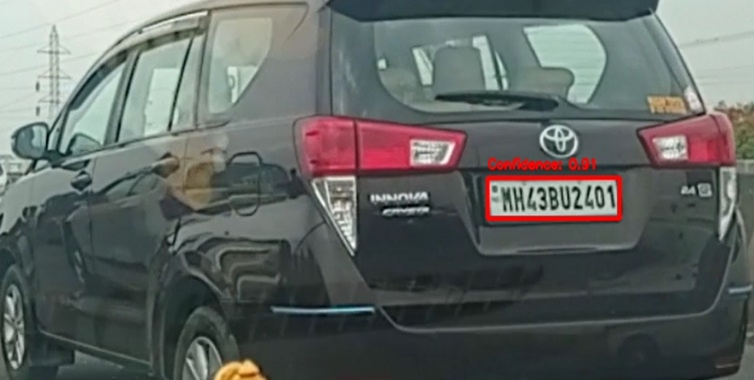

# DeepPlateNet
License Plate Detection and Recognition using YOLOv8 for object detection and CRNN for text recognition.

**DeepPlateNet** is a deep learning-based system for automatic license plate detection and recognition.The code includes modules for training, inference, image preprocessing, and visualization.

---

## 🚀 Tech Stack

- Python
- PyTorch
- OpenCV
- Ultralytics YOLOv8
- Tesseract OCR
- Pandas
- Matplotlib
- CRNN
---

## 📂 Dataset

The dataset for this project can be found on [Google Drive](https://drive.google.com/file/d/1EPJUq4_MQOd4-R-9cyzyfE_pE1lhKdjg/view?usp=sharing).

To use the dataset:

1. Download the ZIP file from the provided Google Drive link.
2. Extract the contents of the ZIP file.

---
## 📈 Results

### 🔍 Sample License Plate Detection

| YOLO Detection Output |
|-------------------------|
| |

### 🔡 CRNN Recognition Sample

| Cropped Plate | Recognized Text |
|---------------|-----------------|
|  | `MH47AU1306` |


### 📊 Performance Metrics

- **mAP@50:** 92.4%  
- **mAP@50-95:** 78.6%  
- **Precision Accuracy:** 88.3%
- **Recall:** 91.2%

## 📦 Requirements

Install the dependencies using the `requirements.txt` file:

```bash
pip install -r requirements.txt
```
---

## 📥 How to Clone the Repository

To clone the repository to your local machine, follow these steps:

1. Copy the repository link from GitHub.
2. Open a terminal or command prompt.
3. Run the following commands:

   ```bash
   git clone https://github.com/diya0510/DeepPlateNet.git
   cd DeepPlateNet

This will download the project files to your machine into a folder named 'DeepPlateNet'.

---
## 🙌 Credits
---------

• Diya   
• Simranjeet kaur 

GitHub:
- Diya: https://github.com/diya0510
- Simranjeet Kaur: https://github.com/simranjeetKaur12

Feel free to ⭐ star and 🤝 contribute!
